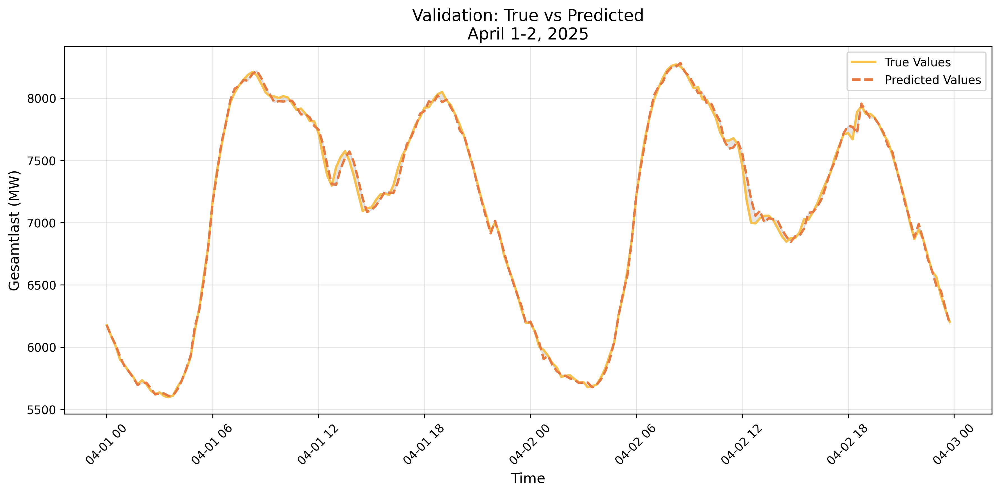

# Energy Consumption Prediction for Austria

This project provides a machine learning solution for forecasting energy load in Austria using time series analysis techniques and the LightGBM framework.

## Overview

The solution leverages historical energy consumption data along with advanced feature engineering to predict energy load with high accuracy. The model incorporates temporal patterns, calendar effects, and rolling statistics to capture the complex dynamics of energy consumption.

## Features

- **Time Series Feature Engineering**: Implements lag features, rolling statistics, and calendar-based features
- **Austrian Holiday Integration**: Includes Austrian national holiday flags as predictive features
- **LightGBM Model**: Utilizes gradient boosting for effective regression prediction
- **Evaluation Metrics**: Reports both MAE and RMSE for model performance assessment
- **Visualization**: Provides clear comparisons between actual and predicted energy loads

## Requirements

The project requires the following Python packages:

```
pandas
numpy
scikit-learn
joblib
lightgbm
dbrepo
holidays
matplotlib
```

## Usage

1. Configure environment variables for database access:

   - `REST_API_ENDPOINT`
   - `REST_API_USERNAME`
   - `REST_API_PASSWORD`

2. Run the notebook cells in sequence to:

   - Load training and validation data
   - Generate time series features
   - Train the LightGBM model
   - Evaluate model performance
   - Save the trained model

3. The trained model is saved as `apg_model.pkl` for future use in deployment scenarios

## Model Performance

The model is evaluated on a validation dataset spanning 2025, with detailed performance metrics provided in the notebook. Visual comparisons between actual and predicted values demonstrate the model's forecasting capability.



## Data Sources

Training and validation data are loaded from a DBRepo database with specific database and subset IDs:

- Database ID: `d4ba48d9-7ed4-4b84-952f-407c1ca8942c`
- Training Subset ID: `5e69a68a-243a-11f0-bf18-c60333c11641`
- Validation Subset ID: `46066f89-243a-11f0-8632-66164a21a937`

## Future Work

Potential enhancements include:

- Integration of weather data as additional features
- Implementation of ensemble methods
- Deployment as a continuous forecasting service

[](https://doi.org/10.5281/zenodo.15299464)
